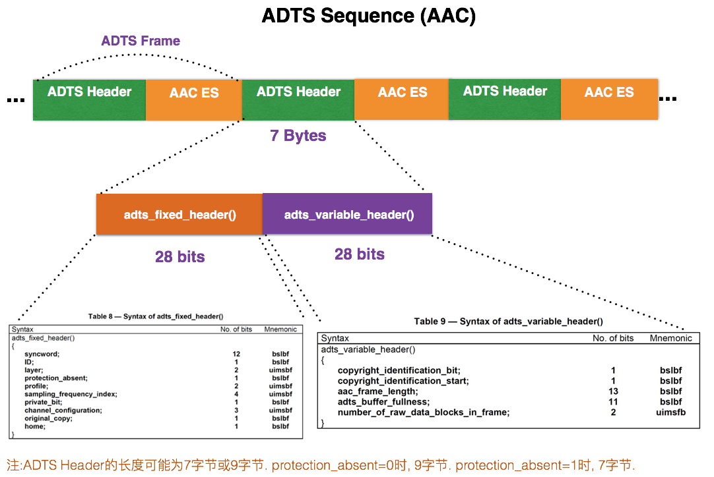
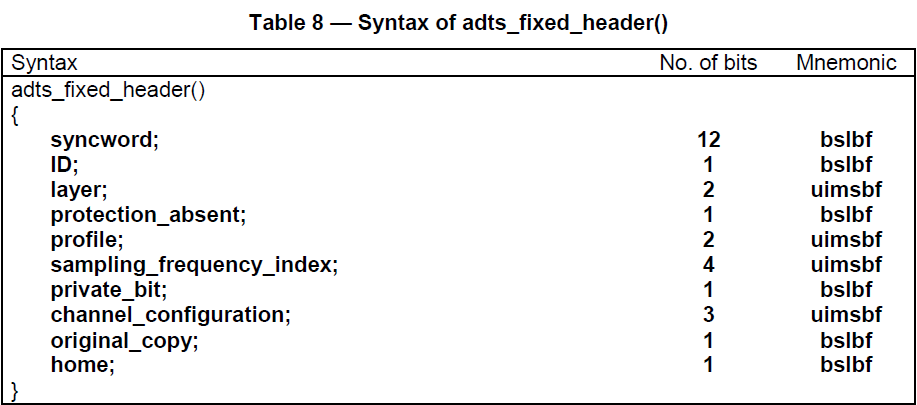
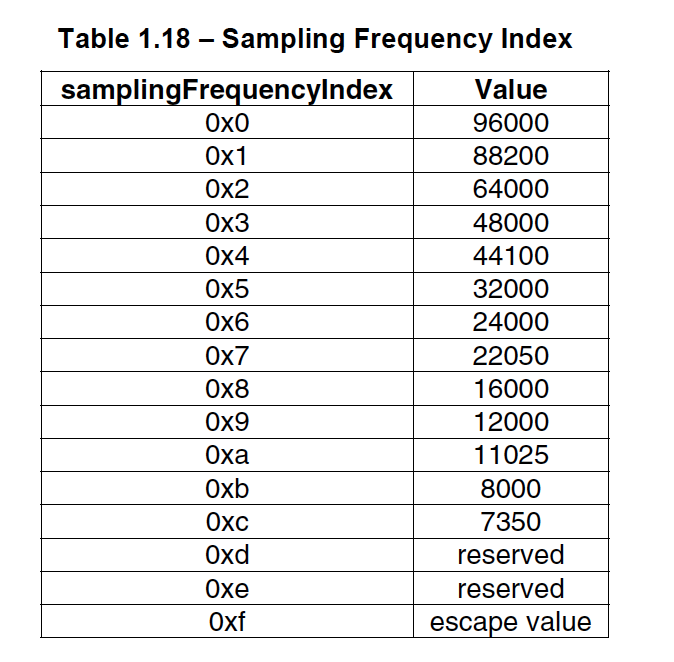
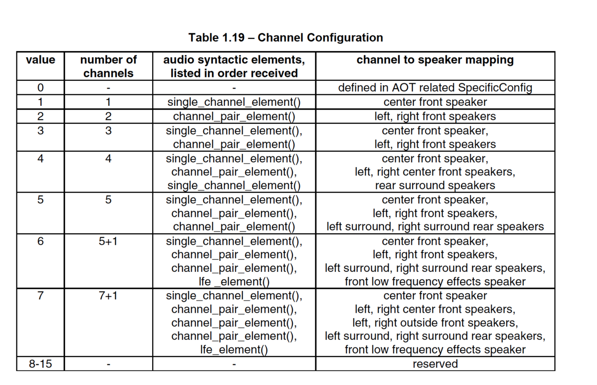
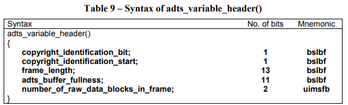

# AAC ADTS

## ADTS简介

ADTS全称是(Audio Data Transport Stream)，是AAC码流的一种的传输包打包格式。



ADTS流由连续的ADTS帧有序排列组成，每个ADTS帧包含头数据和AAC原始ES流数据包组成。

## 字段

每一帧的ADTS的头数据都包含了音频的采样率，声道，帧长度等信息，这样解码器才能解析读取。

ADTS的头信息分为2部分：

- adts_fixed_header();
- adts_variable_header();

### ADTS固定头字段 adts_fixed_header()



- **syncword：** 固定0xFFF，代表一个ADTS帧的开始，用于帧间区分同步。解码器可通过0xFFF确定每个ADTS的开始位置。因为它的存在，解码可以在这个流中任何位置开始, 即可以在任意帧解码。
- **ID：** MPEG版本，0 表示MPEG-4，1 表示 MPEG-2。
- **Layer：** 总是'00'。
- **protection_absent：** 1表示无16位CRC校验码，0表示帧中包含了16位CRC校验码。
- **profile：** 表示使用哪个级别的AAC，如01 Low Complexity(LC) -- AAC LC。profile的值等于 Audio Object Type的值减1（profile = MPEG-4 Audio Object Type - 1）。参考🌐<https://wiki.multimedia.cx/index.php/MPEG-4_Audio>
- **sampling_frequency_index：** 采样率的下标👇
  
- **channel_configuration：** 声道👇
  
- **original_copy：** 参考ISO/IEC 11172-3，2.4.2.3小节 (Table 3)。
- **home：** 参考ISO/IEC 11172-3，2.4.2.3小节 (Table 3)。

### ADTS可变头字段 adts_variable_header()



- **aac_frame_length：** 一个ADTS帧的长度包括ADTS头和AAC原始流。
  >aac_frame_length = (protection_absent == 1 ? 7 : 9) + size(AACFrame)
- **adts_buffer_fullness：** 0x7FF 说明是码率可变的码流。
- **number_of_raw_data_blocks_in_frame：** 表示ADTS帧中有number_of_raw_data_blocks_in_frame + 1个AAC原始帧。
所以说number_of_raw_data_blocks_in_frame == 0 表示说ADTS帧中有一个AAC数据块。(一个AAC-LC原始帧包含一段时间内1024个采样及相关数据)

### 备注

FFmpeg中的ADTS头构造：

```c++
int ff_adts_write_frame_header(ADTSContext *ctx,  
                               uint8_t *buf, int size, int pce_size)  
{  
    PutBitContext pb;  
  
    init_put_bits(&pb, buf, ADTS_HEADER_SIZE);  
  
    /* adts_fixed_header */  
    put_bits(&pb, 12, 0xfff);   /* syncword */  
    put_bits(&pb, 1, 0);        /* ID */  
    put_bits(&pb, 2, 0);        /* layer */  
    put_bits(&pb, 1, 1);        /* protection_absent */  
    put_bits(&pb, 2, ctx->objecttype); /* profile_objecttype */  
    put_bits(&pb, 4, ctx->sample_rate_index);  
    put_bits(&pb, 1, 0);        /* private_bit */  
    put_bits(&pb, 3, ctx->channel_conf); /* channel_configuration */  
    put_bits(&pb, 1, 0);        /* original_copy */  
    put_bits(&pb, 1, 0);        /* home */  
  
    /* adts_variable_header */  
    put_bits(&pb, 1, 0);        /* copyright_identification_bit */  
    put_bits(&pb, 1, 0);        /* copyright_identification_start */  
    put_bits(&pb, 13, ADTS_HEADER_SIZE + size + pce_size); /* aac_frame_length */  
    put_bits(&pb, 11, 0x7ff);   /* adts_buffer_fullness */  
    put_bits(&pb, 2, 0);        /* number_of_raw_data_blocks_in_frame */  
  
    flush_put_bits(&pb);  
  
    return 0;  
}  
```

## 参考资料

- <https://wiki.multimedia.cx/index.php?title=ADTS> 🌐ADTS Format
- <https://wiki.multimedia.cx/index.php/MPEG-4_Audio> 🌐MPEG-4 Audio
