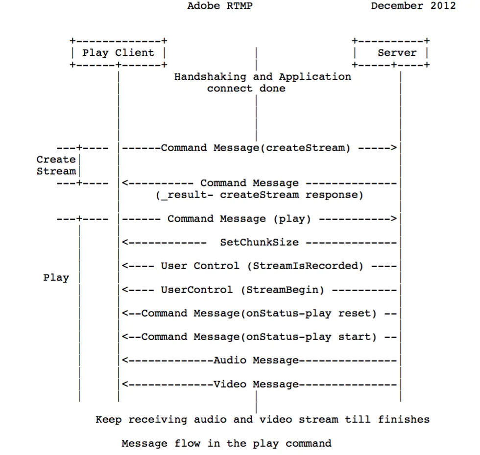

# RTMP

>作者：日月当头
>链接：<https://www.jianshu.com/p/b2144f9bbe28>

## 1. 简介

RTMP协议是应用层协议，是要靠底层可靠的传输层协议（通常是TCP）来保证信息传输的可靠性的。在基于传输层协议的链接建立完成后，RTMP协议也要客户端和服务器通过“握手”来建立基于传输层链接之上的RTMP Connection链接，在Connection链接上会传输一些控制信息，如SetChunkSize,SetACKWindowSize。其中CreateStream命令会创建一个Stream链接，用于传输具体的音视频数据和控制这些信息传输的命令信息。RTMP协议传输时会对数据做自己的格式化，这种格式的消息我们称之为RTMP Message，而实际传输的时候为了更好地实现多路复用、分包和信息的公平性，发送端会把Message划分为带有Message ID的Chunk，每个Chunk可能是一个单独的Message，也可能是Message的一部分，在接受端会根据chunk中包含的data的长度，message id和message的长度把chunk还原成完整的Message，从而实现信息的收发。

## 2. 握手

要建立一个有效的RTMP Connection链接，首先要“握手”:客户端要向服务器发送C0,C1,C2（按序）三个chunk，服务器向客户端发送S0,S1,S2（按序）三个chunk，然后才能进行有效的信息传输。RTMP协议本身并没有规定这6个Message的具体传输顺序，但RTMP协议的实现者需要保证这几点：

- 客户端要等收到S1之后才能发送C2
- 客户端要等收到S2之后才能发送其他信息（控制信息和真实音视频等数据）
- 服务端要等到收到C0之后发送S1
- 服务端必须等到收到C1之后才能发送S2
- 服务端必须等到收到C2之后才能发送其他信息（控制信息和真实音视频等数据）

如果每次发送一个握手chunk的话握手顺序会是这样：

 ```txt
 +-------------+                           +-------------+
 |    Client   |       TCP/IP Network      |    Server   |
 +-------------+            |              +-------------+
       |                    |                     |
 Uninitialized              |               Uninitialized
       |                    |                     |
       |--------[C0]------->|                     |
       |                    |---------[C0]------->|
       |                    |                     |
       |--------[C1]------->|                     |
       |                    |<--------[S0]--------|
       |                    |                     |
 Version sent               |<--------[S1]--------|
       |                    |                     |
       |<-------[S0]--------|                     |
       |<-------[S1]--------|                Version sent
       |                    |                     |
       |                    |---------[C1]------->|
       |                    |                     |
       |--------[C2]------->|                     |
       |                    |<--------[S2]--------|
 Ack sent                   |                  Ack Sent
       |                    |                     |
       |<-------[S2]--------|                     |
       |                    |                     |
       |                    |---------[C2]------->|
 Handshake Done             |               Handshake Done
       |                    |                     |

          Pictorial Representation of Handshake
 ```

 实际实现中为了在保证握手的身份验证功能的基础上尽量减少通信双方交互的次数，一般的发送顺序是这样的：

```txt
+--------+        +--------+
+ client +        + server +
+--------+        +--------+
    |                  |
    | --- [C0+C1] ---> |
    | <- [S0+S1+S2] -- |
    | ----  [C2]  ---> |
```

## 3. RTMP Chunk Stream

Chunk Stream是对传输RTMP Chunk的流的逻辑上的抽象，客户端和服务器之间有关RTMP的信息都在这个流上通信。这个流上的操作也是我们关注RTMP协议的重点。

### 3.1 Message(消息)

这里的Message是指满足该协议格式的、可以切分成Chunk发送的消息，消息包含的字段如下：

- Timestamp（时间戳）：消息的时间戳（但不一定是当前时间，后面会介绍），4个字节
- Length(长度)：是指Message Payload（消息负载）即音视频等信息的数据的长度，3个字节
- TypeId(类型Id)：消息的类型Id，1个字节
- Message Stream ID（消息的流ID）：每个消息的唯一标识，划分成Chunk和还原Chunk为Message的时候都是根据这个ID来辨识是否是同一个消息的Chunk的，4个字节，并且以小端格式存储

### 3.2 Chunking(Message分块)

RTMP在收发数据的时候并不是以Message为单位的，而是把Message拆分成Chunk发送，而且必须在一个Chunk发送完成之后才能开始发送下一个Chunk。每个Chunk中带有MessageID代表属于哪个Message，接受端也会按照这个id来将chunk组装成Message。

为什么RTMP要将Message拆分成不同的Chunk呢？通过拆分，数据量较大的Message可以被拆分成较小的“Message”，这样就可以避免优先级低的消息持续发送阻塞优先级高的数据，比如在视频的传输过程中，会包括视频帧，音频帧和RTMP控制信息，如果持续发送音频数据或者控制数据的话可能就会造成视频帧的阻塞，然后就会造成看视频时最烦人的卡顿现象。同时对于数据量较小的Message，可以通过对Chunk Header的字段来压缩信息，从而减少信息的传输量。（具体的压缩方式会在后面介绍）

Chunk的默认大小是128字节，在传输过程中，通过一个叫做Set Chunk Size的控制信息可以设置Chunk数据量的最大值，在发送端和接受端会各自维护一个Chunk Size，可以分别设置这个值来改变自己这一方发送的Chunk的最大大小。大一点的Chunk减少了计算每个chunk的时间从而减少了CPU的占用率，但是它会占用更多的时间在发送上，尤其是在低带宽的网络情况下，很可能会阻塞后面更重要信息的传输。小一点的Chunk可以减少这种阻塞问题，但小的Chunk会引入过多额外的信息（Chunk中的Header），少量多次的传输也可能会造成发送的间断导致不能充分利用高带宽的优势，因此并不适合在高比特率的流中传输。在实际发送时应对要发送的数据用不同的Chunk Size去尝试，通过抓包分析等手段得出合适的Chunk大小，并且在传输过程中可以根据当前的带宽信息和实际信息的大小动态调整Chunk的大小，从而尽量提高CPU的利用率并减少信息的阻塞机率。

### 3.3 Chunk Format

```txt
+--------------+----------------+--------------------+------------+
| Basic header | Message Header | Extended Timestamp | Chunk Data |
+--------------+----------------+--------------------+------------+
 \_________________   Chunk Header  ________________/
```

#### 3.3.1 Basic Header

包含了chunk type（chunk的类型，CT）和 chunk stream ID（流通道Id，CSID），CSID用来唯一标识一个特定的流通道，CT决定了后面Message Header的格式。Basic Header的长度可能是1，2，或3个字节，其中chunk type的长度是固定的（占2位，注意单位是位，bit），Basic Header的长度取决于CSID的大小,在足够存储这两个字段的前提下最好用尽量少的字节从而减少由于引入Header增加的数据量。

RTMP协议支持用户自定义［3，65599］之间的CSID，0，1，2由协议保留表示特殊信息。0代表Basic Header总共要占用2个字节，CSID在［64，319］之间，1代表占用3个字节，CSID在［64，65599］之间，2代表该chunk是控制信息和一些命令信息，后面会有详细的介绍。

chunk type的长度固定为2位，因此CSID的长度是（6=8-2）、（14=16-2）、（22=24-2）中的一个。

- 当Basic Header为1个字节时，CSID占6位，6位最多可以表示64个数，因此这种情况下CSID在［0，63］之间，其中用户可自定义的范围为［3，63］。
  
```txt
 0 1 2 3 4 5 6 7
+-+-+-+-+-+-+-+-+
|CT |    CSID   | 
+-+-+-+-+-+-+-+-+
```

- 当Basic Header为2个字节时，CSID占14位，此时协议将与chunk type所在字节的其他位都置为0，剩下的一个字节来表示CSID－64，这样共有8个二进制位来存储CSID，8位可以表示［0，255］共256个数，因此这种情况下CSID在［64，319］，其中319=255+64。

```txt
 0 1 2 3 4 5 6 7 0 1 2 3 4 5 6 7
+-+-+-+-+-+-+-+-+-+-+-+-+-+-+-+-+
|CT |     0     |   CSID - 64   | 
+-+-+-+-+-+-+-+-+-+-+-+-+-+-+-+-+
```

- 当Basic Header为3个字节时，CSID占22位，第一个字节的[2-7]置为1，余下的2个字节表示CSID－64，这样共有16个位来存储CSID，16位可以表示［0，65535］共65536个数，因此这种情况下CSID在[64，65599］，其中65599=65535+64，__Basic Header是采用小端存储的方式。__

```txt
 0 1 2 3 4 5 6 7 0 1 2 3 4 5 6 7 0 1 2 3 4 5 6 7
+-+-+-+-+-+-+-+-+-+-+-+-+-+-+-+-+-+-+-+-+-+-+-+-+
|CT |     1     |            CSID - 64          | 
+-+-+-+-+-+-+-+-+-+-+-+-+-+-+-+-+-+-+-+-+-+-+-+-+
```

2个字节和3个字节的Basic Header所能表示的CSID是有交集的［64，319］，但实际实现时还是应该秉着最少字节的原则使用2个字节的表示方式来表示［64，319］的CSID。

#### 3.3.2 Message Header

包含了要发送的实际信息（可能是完整的，也可能是一部分）的描述信息。Message Header的格式和长度取决于Basic Header的chunk type，共有4种不同的格式，由上面所提到的Basic Header中的fmt字段控制。其中第一种格式可以表示其他三种表示的所有数据，但由于其他三种格式是基于对之前chunk的差量化的表示，因此可以更简洁地表示相同的数据，实际使用的时候还是应该采用尽量少的字节表示相同意义的数据。以下按照字节数从多到少的顺序分别介绍这4种格式的Message Header。

__CT=0:__

CT=0时Message Header占用11个字节，其他三种能表示的数据它都能表示，但在chunk stream的开始的第一个chunk和头信息中的时间戳后退（即值与上一个chunk相比减小，通常在回退播放的时候会出现这种情况）的时候必须采用这种格式。

```txt
 0               1               2               3  
 0 1 2 3 4 5 6 7 0 1 2 3 4 5 6 7 0 1 2 3 4 5 6 7 0 1 2 3 4 5 6 7
+-+-+-+-+-+-+-+-+-+-+-+-+-+-+-+-+-+-+-+-+-+-+-+-+-+-+-+-+-+-+-+-+
|                    timestamp                  |   msg length ..
+-+-+-+-+-+-+-+-+-+-+-+-+-+-+-+-+-+-+-+-+-+-+-+-+-+-+-+-+-+-+-+-+
..                              |  msg type id  | msg stream id..
+-+-+-+-+-+-+-+-+-+-+-+-+-+-+-+-+-+-+-+-+-+-+-+-+-+-+-+-+-+-+-+-+
..                                              |
+-+-+-+-+-+-+-+-+-+-+-+-+-+-+-+-+-+-+-+-+-+-+-+-+
```

- timestamp（时间戳）：占用3个字节，因此它最多能表示到16777215=0xFFFFFF, 当它的值超过这个最大值时，这三个字节都置为1，这样实际的timestamp会转存到Extended Timestamp字段中，接受端在判断timestamp字段24个位都为1时就会去Extended timestamp中解析实际的时间戳。
- message length（消息数据的长度）：占用3个字节，表示实际发送的消息的数据如音频帧、视频帧等数据的长度，单位是字节。`length(Chunk Header) + length(Chunk Data)`。
- message type id(消息的类型id)：占用1个字节，表示实际发送的数据的类型，如8代表音频数据、9代表视频数据。
- msg stream id（消息的流id）：占用4个字节，表示该chunk所在的流的ID，和Basic Header的CSID一样，采用小端存储的方式。

__CT=1:__

type=1时Message Header占用7个字节，省去了表示msg stream id的4个字节，表示此chunk和上一次发的chunk所在的流相同，如果在发送端只和对端有一个流链接的时候可以尽量去采取这种格式。

```txt
 0               1               2               3  
 0 1 2 3 4 5 6 7 0 1 2 3 4 5 6 7 0 1 2 3 4 5 6 7 0 1 2 3 4 5 6 7
+-+-+-+-+-+-+-+-+-+-+-+-+-+-+-+-+-+-+-+-+-+-+-+-+-+-+-+-+-+-+-+-+
|               timestamp delta                 |   msg length ..
+-+-+-+-+-+-+-+-+-+-+-+-+-+-+-+-+-+-+-+-+-+-+-+-+-+-+-+-+-+-+-+-+
..                              |  msg type id  |
+-+-+-+-+-+-+-+-+-+-+-+-+-+-+-+-+-+-+-+-+-+-+-+-+
```

- timestamp delta：占用3个字节，注意这里和type＝0时不同，存储的是和上一个chunk的时间差。类似上面提到的timestamp，当它的值超过3个字节所能表示的最大值时，三个字节都置为1，实际的时间戳差值就会转存到Extended Timestamp字段中，接受端在判断timestamp delta字段24个位都为1时就会去Extended timestamp中解析时机的与上次时间戳的差值。

__CT=2:__

CT=2时Message Header占用3个字节，相对于type＝1格式又省去了表示消息长度的3个字节和表示消息类型的1个字节，表示此chunk和上一次发送的chunk所在的流、消息的长度和消息的类型都相同。余下的这三个字节表示timestamp delta，使用同type＝1。

```txt
 0               1               2               
 0 1 2 3 4 5 6 7 0 1 2 3 4 5 6 7 0 1 2 3 4 5 6 7 
+-+-+-+-+-+-+-+-+-+-+-+-+-+-+-+-+-+-+-+-+-+-+-+-+
|               timestamp delta                 |
+-+-+-+-+-+-+-+-+-+-+-+-+-+-+-+-+-+-+-+-+-+-+-+-+
```

__CT=3:__

CT=2时，无Message Header，它表示这个chunk的Message Header和上一个是完全相同的，自然就不用再传输一遍了。当它跟在Type＝0的chunk后面时，表示和前一个chunk的时间戳都是相同的。什么时候连时间戳都相同呢？就是一个Message拆分成了多个chunk，这个chunk和上一个chunk同属于一个Message。而当它跟在Type＝1或者Type＝2的chunk后面时，表示和前一个chunk的时间戳的差是相同的。比如第一个chunk的Type＝0，timestamp＝100，第二个chunk的Type＝2，timestamp delta＝20，表示时间戳为100+20=120，第三个chunk的Type＝3，表示timestamp delta＝20，时间戳为120+20=140。

#### 3.3.3 Extended Timestamp

上面我们提到在chunk中会有时间戳timestamp和时间戳差timestamp delta，并且它们不会同时存在，只有这两者之一大于3个字节能表示的最大数值0xFFFFFF时，才会用这个字段来表示真正的时间戳，否则这个字段为0。扩展时间戳占4个字节，能表示的最大数值就是0xFFFFFFFF＝4294967295。当扩展时间戳启用时，timestamp字段或者timestamp delta要全置为1，表示应该去扩展时间戳字段来提取真正的时间戳或者时间戳差。注意扩展时间戳存储的是完整值，而不是减去时间戳或者时间戳差的值。

### 3.4 Protocol Control Message

在RTMP的chunk流会用一些特殊的值来代表协议的控制消息，它们的Message Stream ID必须为0（代表控制流信息），CSID必须为2，Message Type ID可以为1，2，3，5，6，具体代表的消息会在下面依次说明。控制消息的接受端会忽略掉chunk中的时间戳，收到后立即生效。

- __Set Chunk Size(Message Type ID=1):__ 设置chunk中Data字段所能承载的最大字节数，默认为128B，通信过程中可以通过发送该消息来设置chunk Size的大小（不得小于128B），而且通信双方会各自维护一个chunkSize，两端的chunkSize是独立的。比如当A想向B发送一个200B的Message，但默认的chunkSize是128B，因此就要将该消息拆分为Data分别为128B和72B的两个chunk发送，如果此时先发送一个设置chunkSize为256B的消息，再发送Data为200B的chunk，本地不再划分Message，B接受到Set Chunk Size的协议控制消息时会调整的接受的chunk的Data的大小，也不用再将两个chunk组成为一个Message。
以下为代表Set Chunk Size消息的chunk的Data：

```txt
 0               1               2               3  
 0 1 2 3 4 5 6 7 0 1 2 3 4 5 6 7 0 1 2 3 4 5 6 7 0 1 2 3 4 5 6 7
+-+-+-+-+-+-+-+-+-+-+-+-+-+-+-+-+-+-+-+-+-+-+-+-+-+-+-+-+-+-+-+-+
|0|                   max chunk size(31bits)                    |
+-+-+-+-+-+-+-+-+-+-+-+-+-+-+-+-+-+-+-+-+-+-+-+-+-+-+-+-+-+-+-+-+
```

其中第一位必须为0，chunk Size占31个位，最大可代表2147483647＝0x7FFFFFFF＝231-1，但实际上所有大于16777215=0xFFFFFF的值都用不上，因为chunk size不能大于Message的长度，表示Message的长度字段是用3个字节表示的，最大只能为0xFFFFFF。

- __Abort Message(Message Type ID=2):__ 当一个Message被切分为多个chunk，接受端只接收到了部分chunk时，发送该控制消息表示发送端不再传输同Message的chunk，接受端接收到这个消息后要丢弃这些不完整的chunk。Data数据中只需要一个CSID，表示丢弃该CSID的所有已接收到的chunk。

```txt
 0               1               2               3  
 0 1 2 3 4 5 6 7 0 1 2 3 4 5 6 7 0 1 2 3 4 5 6 7 0 1 2 3 4 5 6 7
+-+-+-+-+-+-+-+-+-+-+-+-+-+-+-+-+-+-+-+-+-+-+-+-+-+-+-+-+-+-+-+-+
|                      chunk stream id                          |
+-+-+-+-+-+-+-+-+-+-+-+-+-+-+-+-+-+-+-+-+-+-+-+-+-+-+-+-+-+-+-+-+
```

- __Acknowledgement(Message Type ID=3):__ 当收到对端的消息大小等于窗口大小（Window Size）时接受端要回馈一个ACK给发送端告知对方可以继续发送数据。窗口大小就是指收到接受端返回的ACK前最多可以发送的字节数量，返回的ACK中会带有从发送上一个ACK后接收到的字节数。

```txt
 0               1               2               3  
 0 1 2 3 4 5 6 7 0 1 2 3 4 5 6 7 0 1 2 3 4 5 6 7 0 1 2 3 4 5 6 7
+-+-+-+-+-+-+-+-+-+-+-+-+-+-+-+-+-+-+-+-+-+-+-+-+-+-+-+-+-+-+-+-+
|                        sequence number                        |
+-+-+-+-+-+-+-+-+-+-+-+-+-+-+-+-+-+-+-+-+-+-+-+-+-+-+-+-+-+-+-+-+
```

- __Window Acknowledgement Size(Message Type ID=5):__ 发送端在接收到接受端返回的两个ACK间最多可以发送的字节数。

```txt
 0               1               2               3  
 0 1 2 3 4 5 6 7 0 1 2 3 4 5 6 7 0 1 2 3 4 5 6 7 0 1 2 3 4 5 6 7
+-+-+-+-+-+-+-+-+-+-+-+-+-+-+-+-+-+-+-+-+-+-+-+-+-+-+-+-+-+-+-+-+
|                 acknowledgement windows size                  |
+-+-+-+-+-+-+-+-+-+-+-+-+-+-+-+-+-+-+-+-+-+-+-+-+-+-+-+-+-+-+-+-+
```

- __Set Peer Bandwidth(Message Type ID=6):__ 限制对端的输出带宽。接受端接收到该消息后会通过设置消息中的Window ACK Size来限制已发送但未接受到反馈的消息的大小来限制发送端的发送带宽。如果消息中的Window ACK Size与上一次发送给发送端的size不同的话要回馈一个Window Acknowledgement Size的控制消息。
  
  - Hard(Limit Type＝0):接受端应该将Window Ack Size设置为消息中的值。
  - Soft(Limit Type=1):接受端可以讲Window Ack Size设为消息中的值，也可以保存原来的值（前提是原来的Size小与该控制消息中的Window Ack Size）。
  - Dynamic(Limit Type=2):如果上次的Set Peer Bandwidth消息中的Limit Type为0，本次也按Hard处理，否则忽略本消息，不去设置Window Ack Size。

```txt
 0               1               2               3  
 0 1 2 3 4 5 6 7 0 1 2 3 4 5 6 7 0 1 2 3 4 5 6 7 0 1 2 3 4 5 6 7
+-+-+-+-+-+-+-+-+-+-+-+-+-+-+-+-+-+-+-+-+-+-+-+-+-+-+-+-+-+-+-+-+
|                  acknowledgement windows size                 |
+-+-+-+-+-+-+-+-+-+-+-+-+-+-+-+-+-+-+-+-+-+-+-+-+-+-+-+-+-+-+-+-+
|  limit type   |
+-+-+-+-+-+-+-+-+
```

## 4. 不同类型的RTMP Message

- Command Message(命令消息，Message Type ID＝17或20)：表示在客户端盒服务器间传递的在对端执行某些操作的命令消息，如connect表示连接对端，对端如果同意连接的话会记录发送端信息并返回连接成功消息，publish表示开始向对方推流，接受端接到命令后准备好接受对端发送的流信息，后面会对比较常见的Command Message具体介绍。当信息使用AMF0编码时，Message Type ID＝20，AMF3编码时Message Type ID＝17.
- Data Message（数据消息，Message Type ID＝15或18）：传递一些元数据（MetaData，比如视频名，分辨率等等）或者用户自定义的一些消息。当信息使用AMF0编码时，Message Type ID＝18，AMF3编码时Message Type ID＝15.
- Shared Object Message(共享消息，Message Type ID＝16或19)：表示一个Flash类型的对象，由键值对的集合组成，用于多客户端，多实例时使用。当信息使用AMF0编码时，Message Type ID＝19，AMF3编码时Message Type ID＝16.
- Audio Message（音频信息，Message Type ID＝8）：音频数据。
- Video Message（视频信息，Message Type ID＝9）：视频数据。
- Aggregate Message (聚集信息，Message Type ID＝22)：多个RTMP子消息的集合
- User Control Message Events(用户控制消息，Message Type ID=4):告知对方执行该信息中包含的用户控制事件，比如Stream Begin事件告知对方流信息开始传输。和前面提到的协议控制信息（Protocol Control Message）不同，这是在RTMP协议层的，而不是在RTMP chunk流协议层的，这个很容易弄混。该信息在chunk流中发送时，Message Stream ID=0,Chunk Stream Id=2,Message Type Id=4。

> AMF编码参考[这里](./amf.md)

### 4.1 Command Message(命令消息，Message Type ID＝17或20)

发送端发送时会带有命令的名字，如Connect，TransactionID表示此次命令的标识，Command Object表示相关参数。接受端收到命令后，会返回以下三种消息中的一种：_result 消息表示接受该命令，对端可以继续往下执行流程，_error消息代表拒绝该命令要执行的操作，method name消息代表要在之前命令的发送端执行的函数名称。这三种回应的消息都要带有收到的命令消息中的TransactionId来表示本次的回应作用于哪个命令。
可以认为发送命令消息的对象有两种，一种是NetConnection，表示双端的上层连接，一种是NetStream，表示流信息的传输通道，控制流信息的状态，如Play播放流，Pause暂停。

#### 4.1.1 NetConnection Commands(连接层的命令)

用来管理双端之间的连接状态，同时也提供了异步远程方法调用（RPC）在对端执行某方法，以下是常见的连接层的命令：

##### 4.1.1.1 Connect

用于客户端向服务器发送连接请求，消息的结构如下:

|字段|类型|说明|
|-|-|-|
|Command Name(命令名字)|String|命令的名字，如"connect"|
|Transaction ID(事务ID)|Number|恒为1|
|Command Object(命令包含的参数对象)|Object|键值对集合表示的命令参数|
|Optional User Arguments（额外的用户参数)|Object|用户自定义的额外信息|

第三个字段中的Command Object中会涉及到很多键值对，这里不再一一列出，使用时可以参考协议的官方文档。
消息的回应有两种，_result表示接受连接，_error表示连接失败。

e.g.

```txt
RTMP Header
    00.. .... = Format: 0
    ..00 0011 = Chunk Stream ID: 3
    Timestamp: 0
    Body size: 199
    Type ID: AMF0 Command (0x14)
    Stream ID: 0

RTMP Body
    String 'connect'
    Number 1
    Object (8 items)
```

##### 4.1.1.2 Call

用于在对端执行某函数，即常说的RPC：远程进程调用。消息的结构如下:

|字段|类型|说明|
|-|-|-|
|Procedure Name(进程名)|String|要调用的进程名称|
|Transaction ID|Number|如果想要对端响应的话置为非0值，否则置为0|
|Command Object|Object|命令参数|
|Optional Arguents|Object|用户自定义参数|

如果消息中的TransactionID不为0的话，对端需要对该命令做出响应，响应的消息结构如下：

|字段|类型|说明|
|-|-|-|
|Command Name(命令名)|String|命令的名称|
|TransactionID|Number|上面接收到的命令消息中的TransactionID|
|Command Object|Object|命令参数|
|Optional Arguments|Object|用户自定义参数|

##### 4.1.1.3 Create Stream

创建传递具体信息的通道，从而可以在这个流中传递具体信息，传输信息单元为Chunk。

|字段|类型|说明|
|-|-|-|
|Command Name(命令名)|String|"createStream"|
|TransactionID|Number|上面接收到的命令消息中的TransactionID|
|Command Object|Object|命令参数|
|Optional Arguments|Object|用户自定义参数|

#### 4.1.2 NetStream Commands(流连接上的命令)

Netstream建立在NetConnection之上，通过NetConnection的createStream命令创建，用于传输具体的音频、视频等信息。在传输层协议之上只能连接一个NetConnection，但一个NetConnection可以建立多个NetStream来建立不同的流通道传输数据。
以下会列出一些常用的NetStream Commands，服务端收到命令后会通过onStatus的命令来响应客户端，表示当前NetStream的状态。
onStatus命令的消息结构如下：

|字段|类型|说明|
|-|-|-|
|Command Name|String|"onStatus"|
|TransactionID|Number|恒为0|
|Command Object|NULL|对onSatus命令来说不需要这个字段|
|Info Object|Object|AMF类型的Object，至少包含以下三个属性：1，“level”，String类型，可以为“warning”、"status"、"error"中的一种；2，"code",String类型，代表具体状态的关键字,比如"NetStream.Play.Start"表示开始播流；3，"description"，String类型，代表对当前状态的描述，提供对当前状态可读性更好的解释，除了这三种必要信息，用户还可以自己增加自定义的键值对|

e.g.

```txt
Real Time Messaging Protocol (AMF0 Command onStatus('NetStream.Play.Start'))
    RTMP Header
        00.. .... = Format: 0
        ..01 0100 = Chunk Stream ID: 20
        Timestamp: 0
        Body size: 148
        Type ID: AMF0 Command (0x14)
        Stream ID: 1
    RTMP Body
        String 'onStatus'
        Number 0
        Null
        Object (5 items)
            AMF0 type: Object (0x03)
            Property 'level' String 'status'
            Property 'code' String 'NetStream.Play.Start'
            Property 'description' String 'start...'
            Property 'details' String 'xxx'
            Property 'clientid' String '6646583_1_575797248'
            End Of Object Marker
```

##### 4.1.2.1 play(播放)

由客户端向服务器发起请求从服务器端接受数据（如果传输的信息是视频的话就是请求开始播流），可以多次调用，这样本地就会形成一组数据流的接收者。注意其中有一个reset字段，表示是覆盖之前的播流（设为true）还是重新开始一路播放（设为false）。
play命令的结构如下：

|字段|类型|说明
|-|-|-|
|命令名|String|"play"|
|事务ID|Number|恒为0|
|命令参数对象|Null|不需要此字段，设为空|
|流名称|String|要播放的流的名称|
|开始位置|Number|可选参数，表示从何时开始播流，以秒为单位。默认为－2，代表选取对应该流名称的直播流，即当前正在推送的流开始播放，如果对应该名称的直播流不存在，就选取该名称的流的录播版本，如果这也没有，当前播流端要等待直到对端开始该名称的流的直播。如果传值－1，那么只会选取直播流进行播放，即使有录播流也不会播放；如果传值或者正数，就代表从该流的该时间点开始播放，如果流不存在的话就会自动播放播放列表中的下一个流|
|周期|Number|可选参数，表示回退的最小间隔单位，以秒为单位计数。默认值为－1，代表直到直播流不再可用或者录播流停止后才能回退播放；如果传值为0，代表从当前帧开始播放|
|重置|Boolean|可选参数，true代表清除之前的流，重新开始一路播放，false代表保留原来的流，向本地的播放列表中再添加一条播放流|

##### 4.1.2.2 play2（播放）

和上面的play命令不同的是，play2命令可以将当前正在播放的流切换到同样数据但不同比特率的流上，服务器端会维护多种比特率的文件来供客户端使用play2命令来切换。

|字段|类型|说明
|-|-|-|
|Command Name|String|"play2"|
|TransactionID|Number|恒为0|
|Command Object|NULL,对onSatus命令来说不需要这个字段|
|parameters|Object|AMF编码的Flash对象，包括了一些用于描述flash.net.NetstreamPlayOptions ActionScript obejct的参数|

##### 4.1.2.3 deleteStream(删除流)

用于客户端告知服务器端本地的某个流对象已被删除，不需要再传输此路流。

|字段|类型|说明
|-|-|-|
|Command Name|String|"deleteStream"|
|TransactionID|Number|恒为0|
|Command Object|NULL,对onSatus命令来说不需要这个字段|
|Stream ID（流ID)|Number|本地已删除，不再需要服务器传输的流的ID|

##### 4.1.2.4 receiveAudio(接收音频)

通知服务器端该客户端是否要发送音频，receiveAudio命令结构如下：

|字段|类型|说明
|-|-|-|
|Command Name|String|"receiveAudio"|
|TransactionID|Number|恒为0|
|Command Object|NULL|对onSatus命令来说不需要这个字段|
|Bool Flag|Boolean|true表示发送音频，如果该值为false，服务器端不做响应，如果为true的话，服务器端就会准备接受音频数据，会向|客户端回复NetStream.Seek.Notify和NetStream.Play.Start的Onstatus命令告知客户端当前流的状态|

##### 4.1.2.5 receiveVideo(接收视频)

通知服务器端该客户端是否要发送视频，receiveVideo命令结构如下：

|字段|类型|说明
|-|-|-|
|Command Name|String|"receiveVideo"|
|TransactionID|Number|恒为0|
|Command Object|NULL|对onSatus命令来说不需要这个字段|
|Bool Flag|Boolean|true表示发送视频，如果该值为false，服务器端不做响应，如果为true的话，服务器端就会准备接受视频数据，会向|客户端回复NetStream.Seek.Notify和NetStream.Play.Start的Onstatus命令告知客户端当前流的状态|

##### 4.1.2.6 publish(推送数据)

由客户端向服务器发起请求推流到服务器，publish命令结构如下：

|字段|类型|说明|
|-|-|-|
|Command Name|String|"publish"|
|TransactionID|Number|恒为0|
|Command Object|NULL,对onSatus命令来说不需要这个字段|
|Publishing Name（推流的名称）|String|流名称|
|Publishing Type（推流类型）|String|"live"、"record"、"append"中的一种。live表示该推流文件不会在服务器端存储；record表示该推流的文件会在服务器应用程序下的子目录下保存以便后续播放，如果文件已经存在的话删除原来所有的内容重新写入；append也会将推流数据保存在服务器端，如果文件不存在的话就会建立一个新文件写入，如果对应该流的文件已经存在的话保存原来的数据，在文件末尾接着写入|

##### 4.1.2.7 seek(定位流的位置)

定位到视频或音频的某个位置，以毫秒为单位，seek命令的结构如下：

|字段|类型|说明
|-|-|-|
|Command Name|String|"seek"|
|TransactionID|Number|恒为0|
|Command Object|NULL|对onSatus命令来说不需要这个字段|
|milliSeconds|Number|定位到该文件的xx毫秒处|

##### 4.1.2.8 pause（暂停）

客户端告知服务端停止或恢复播放，pause命令的结构如下：

|字段|类型|说明|
|-|-|-|
|Command Name|String|"pause"|
|TransactionID|Number|恒为0|
|Command Object|NULL|对onSatus命令来说不需要这个字段|
|Pause/Unpause Flag|Boolean|true表示暂停，false表示恢复|
|milliSeconds|Number|暂停或者恢复的时间，以毫秒为单位|

如果Pause为true即表示客户端请求暂停的话，服务端暂停对应的流会返回NetStream.Pause.Notify的onStatus命令来告知客户端当前流处于暂停的状态，当Pause为false时，服务端会返回NetStream.Unpause.Notify的命令来告知客户端当前流恢复。如果服务端对该命令响应失败，返回_error信息。

## 5. 推拉流消息过程

__推流:__


__拉流:__



## 6. 参考

1. <https://www.jianshu.com/p/b2144f9bbe28> 带你吃透RTMP
2. <https://www.jianshu.com/p/37a86c11df91> RTMP Handshake(握手协议)
3. [Adobe’s Real Time Messaging Protocol](./resource/rtmp.pdf)
