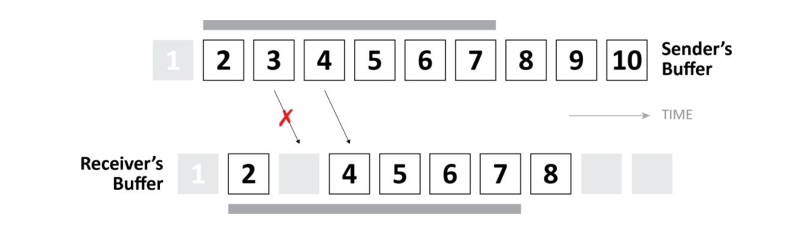

# libsrt缓冲区



srt的缓冲区控制是srt协议实现的核心，这里通过libsrt中的缓冲区实现来对srt的传输控制策略进行分析。

## 数据发送缓冲区

```c
/*
 *
 *   SndBuffer
 *   |         Data Buffer       |         Data Buffer       |
 *   |---------------------------|---------------------------|....
 *    ^      ^      ^      ^      ^      ^      ^      ^     
 *    |      |      |      |      |      |      |      |     
 *   |Block->Block->Block->Block->Block->Block->Block->Block->m_pBlock|
 *       |             |      |                   |
 *       |             |      \___ m_pCurrBlock   \___ m_pLastBlock
 *       |             |      
 *       |             \___ m_pFirstBlock
 *       \___ m_pBlock
 *                     <------m_iCount------>
 *   <------------------------m_iSize---------------------->
 */
```

上面的结构是发送缓冲区的内存结构，每一个Block表示一个数据包报文，通过环状链表的方式构建发送缓冲区队列：

- `m_pBlock`，缓冲区的头指针，主要用于队头索引。
- `m_pFirstBlock`，缓冲区中第一个数据包指针，这个数据是已发送还未确认的状态。
- `m_pCurrBlock`，缓冲区中准备发送的第一个数据包指针。
- `m_pLastBlock`，缓冲区中第一个空闲数据包指针，当添加新的数据时从这里开始。如果`m_pCurrBlock == m_pLastBlock`则说明当前队列中无待发送的数据。
- `m_iSize`，缓冲区Block的数量，主要用于计算缓冲区是否需要扩张。
- `m_iCount`，缓冲区有效Block的数量。

每个Block的数据缓存大小都是相同的，这个通过[SRTO_MSS](./libsrt/srt_options(zh).md)选项进行控制，它提供待发送的消息容器，在发送消息时会被打包成Packet再进入网络I/O。`Data Buffer`是数据内存池，它被Block划分成多个大小相同的块，应用层发送的数据会被拆分后拷贝到`Data Buffer`。

### 装载待发送数据

应用层发送数据时，数据会先被装入发送缓冲区队列，协议通过缓冲区对发送速率，数据丢失重传等策略进行控制响应。通常应用托付的会是一个较大的数据包（一般会大于MSS），这个主要是为了避免IP报文分片，减少丢包重传数据量以及更精细的发送带宽控制，它被拆分成多个Block后按原先的字节顺序加入队列中，然后等待发送线程的控制调度再交付到网络I/O。

一块数据被拆分到多个Block，它们具有相同的原始数据时间戳，便于接收方和发送方对数据包的交付时延进行判断控制（主要是便于触发丢弃策略后原先的同一块数据中的部分分片再被传输，这些分片即使传输成功也是极大概率是无效的）。它们还具有连续不同的数据序号和消息序号，主要用于数据接收方按序恢复数据和请求丢包重传。

应用层在建立连接后可以不断的发送数据，发送缓冲区也会不断的进行扩张，如果传输的速度跟不上就会导致缓冲区不断增长最终导致非常高的系统内存消耗。libsrt中有一个[SRTO_SNDBUF](./libsrt/srt_options(zh).md)选项用于控制发送队列中最大的数量，它可以配合[SRTO_MSS](./libsrt/srt_options(zh).md)选项来控制缓存区的内存使用量，但是`SRTO_MSS`会涉及到报文分片等问题，这个值一般维持默认值（以太网MTU1500），所以主要还是通过`SRTO_SNDBUF`控制。如果应用层交付的一个数据包大于了缓冲区的内存上限，这时会直接发送失败。

>在Live模式下要特别注意视频帧数据是否可能超过发送缓冲区限制，默认值大概是10MiB。特别是在高码率的情况下，这个缓冲区上限还应该配合数据最大延时进行计算可能出现的最大缓存情况。

libsrt的发送接口有同步和异步模式，可以通过[SRTO_SNDSYN](./libsrt/srt_options(zh).md)控制，默认是同步模式。它们间的主要区别是当发送的数据超过了当前缓冲区空闲大小时，异步模式立即返回，同步模式会等待一段指定的时间，如果等待期间将数据放入缓冲区，就会将数据放入再返回，否则直到超时。同步模式的等待超时时间可以通过[SRTO_SNDTIMEO](./libsrt/srt_options(zh).md)选项控制。数据装载到缓冲区后，对于应用层来说，发送过程就已经结束，接下来就交给协议传输到接收方。

### 数据交付

待发送的数据由libsrt发送线程调度，从发送缓冲区获取数据信息打包后通过UDP Socket发送，同时`m_pCurrBlock`会向后移动，并计算下一次数据发送的时间，重新加入发送线程的调度。libsrt中主要通过控制发送数据的时间间隔来控制发送带宽（这样可以带来平滑的带宽控制），计算下一次数据发送时间需要先通过带宽选项[SRTO_MAXBW](./libsrt/srt_options(zh).md)或是通过[SRTO_INPUTBW](./libsrt/srt_options(zh).md)和[SRTO_OHEADBW](./libsrt/srt_options(zh).md)计算最小数据发送间隔，初始推导：`SendInterval=AvgPacketSize/MaxBW`，如果是文件模式发送过程中会根据测量的实际平均带宽进行调整。

>数据加密也是在打包的过程中处理。

缓冲区队列中每一个数据包它可能被多次发送，也可能被丢弃（Live模式下，在约定延迟的时间内无法送达）。多次发送可能的原因：

1. 发送方在一段时间内未收到数据确认(ACK)，认为数据包很可能已经出现丢包，会主动重发。
2. 接受方通过接收到的不连续的数据包序号判断丢包，发起重传请求(NAKs)，发送方收到重传请求后再次发送请求的数据包。

第一种情况默认只会在File模式下出现，libsrt中会检查接收方是否打开[SRTO_NAKREPORT](./libsrt/srt_options(zh).md)，当接收方打开了周期性NAKs就不会主动发起快速重传。快速重传和NAK同时运作很可能会导致一次丢包数据被多次重传，因为发送方必须响应NAKs。

数据被放弃传输的原因（只有Live模式下才会触发）：

1. 接收方认为数据超时，放弃接收，直接发送ACK，发送方收到ACK后就会放弃发送。
2. 发送方认为数据已经超时，放弃发送。

第一种情况在下文中说明，第二中情况超时的可以通过[SRTO_SNDDROPDELAY](./libsrt/srt_options(zh).md)选项控制，推导：`Delay = PeerLatency + SndDropDelay`。它的最小值是1020ms(1000 + 2 * interval between sending ACKs)。

## 数据接收缓冲区

```c
/*
 *   RcvBuffer (circular buffer):
 *
 *   |<------------------- m_iSize ----------------------------->|
 *   |       |<--- acked pkts -->|<--- m_iMaxPos --->|           |
 *   |       |                   |                   |           |
 *   +---+---+---+---+---+---+---+---+---+---+---+---+---+   +---+
 *   | 0 | 0 | 1 | 1 | 1 | 0 | 1 | 1 | 1 | 1 | 0 | 1 | 0 |...| 0 | m_pUnit[]
 *   +---+---+---+---+---+---+---+---+---+---+---+---+---+   +---+
 *             |                 | |               |
 *             |                   |               \__last pkt received
 *             |                   \___ m_iLastAckPos: last ack sent
 *             \___ m_iStartPos: first message to read
 */
```

上面是libsrt数据接收“环形缓冲区”，缓冲区以SRT Packet为单位进行管理。缓冲区的控制字段：

- `m_iSize`是缓冲区的大小，它可以通过[SRTO_RCVBUF](./libsrt/srt_options(zh).md)选项进行控制，最小值32。
- `m_iStartPos`是当前缓冲区数据存放的开始位置。
- `m_iLastAckPos`是当前已确认的最后一个数据位置。
- `m_iMaxPos`是当前已接收到的最后一个包和最后一个确认包间的增量（虽然命名看上去是表示位置，但实际上表示的是长度），这个字段主要用于缓冲区遍历时有效数据区域的判断。

libsrt中接收到数据包后会先进行数据包装载到缓冲区中对应的位置或是丢弃，然后通过一些统计过程后将数据交付到应用层，下面对数据接收后的处理流程进行分析。

### 数据装载到缓冲区

SRT的每一个数据报文都会对应到一个缓冲区的位置，当从socket中接收到一个SRT数据报文后，会根据包头的数据序号计算报文在缓冲区的位置，推导：`offset = packet.m_iSeqNo - m_iRcvLastSkipAck; index = (buffer.m_iLastAckPos + offset) % m_iSize;`

收到的数据包只能正常进入缓冲区或者直接丢弃，数据包被丢弃的情况：

1. 包数据序号小于`m_iRcvLastSkipAck`，在File模式下，出现这个情况都是由于包重放，在Live模式下还可能是数据接收等待超时，接收方主动放弃，ack自动后移造成。
2. 包序号和在队列中的某一个数据包序号重复，这个都是由于包重放导致。
3. `offset`已经大于了当前接收缓冲区的有效数据长度。

第三种情况是在srt的协议中并没有相关的说明，找到libsrt代码仓库中的记录和[issue](https://github.com/Haivision/srt/pull/300)看到主要是避免缓冲区膨胀，按照目前每个包都会在缓冲区中对应的位置存放的设计，如果要存放这样的数据需要增大缓冲区，而且缓冲区可能会被增大非常多。

代码中还有一种情况，`offset`大于当前接收缓冲区空闲容器长度且接收缓冲区当前无可交付数据包(`m_iStartPos == m_iLastAckPos`)情况下，会直接断开连接，这个只会在Live模式触发。

```c
if (m_bTsbPd && m_bTLPktDrop && m_pRcvBuffer->empty())
{
    ...
    processClose();
    return -1;
}
else
{
    ...
    return -1;
}
```

#### ARQ

ARQ（请求重传）机制在数据装载缓冲区过程中进行处理，在进入缓冲区的同时根据数据序号是否连续来判断丢包，如果存在丢包，将会发起重传请求。同时还有周期性的检查缓存队列中的丢包数据并发送NAKs，用于适应NAKs丢包问题，发送周期推导：`NAKInterval = RTT + 4 * RTTVar`。

### 数据交付

SRT收到数据并不会立即将数据交付到应用层，应用层读取数据时必须是已经被确认的包。ACK的触发目前按照[《Secure Reliable Transport Protocol》](srt_protocol_technical_overview(zh).md) 中的说明，有两种触发条件：

1. 周期ACK，大概是每隔10ms会周期性触发，当ACKACK已收到后就不会发送。
2. Light ACK，这个主要是在接收速度较快的情况下触发，每64个包会触发一次。周期ACK会覆盖Light ACK，即使收到64个包，如果已经有周期性ACK发出那么也不会被触发。同时发送方不会对Light ACK回复ACKACK。

这样的策略导致了即使收到连续的包也不会交付给应用层，但是这个延迟会很短。

如果在一段数据中出现丢包，在File模式下会一直触发[ARQ](#arq)，直到数据被正常接收，才会进行后续的数据交付，但是在Live模式下是可以根据数据时延特性忽略丢弃的数据包。在接收方的超时时间通过[SRTO_RCVLATENCY](./libsrt/srt_options(zh).md)和[SRTO_PEERLATENCY](./libsrt/srt_options(zh).md)或是[SRTO_LATENCY](./libsrt/srt_options(zh).md)控制。

>`SRTO_RCVLATENCY`是数据接收方设置的默认接收延迟，`SRTO_PEERLATENCY`是发送方期望的接收延迟，会通过握手包交换这个数据，最终协商的接收延迟推导：`Latency=max(SRTO_RCVLATENCY, SRTO_PEERLATENCY)`。如果通过`SRTO_LATENCY`进行延迟设置，内部实际上是同时修改`SRTO_RCVLATENCY`和`SRTO_RCVLATENCY`到同一个值。

## 备注

- 当前基于1.4.2发布版本代码进行分析。
- 上文中出现的“以File模式和Live模式为前提讨”指的是使用不同模式的下的默认选项配置。例如接收延迟丢弃控制可以通过[SRTO_TSBPDMODE](./libsrt/srt_options(zh).md)开关，只是File模式默认关闭，Live模式默认打开。
- File模式和Live模式的主要区别在于：
  - 拥塞控制策略不同，File模式会实时调整发送带宽，Live模式由于输入带宽通常是无法控制的所以它始终按能达到的最快速度发送。
  - [TsbPD](./srt_protocol_technical_overview(zh).md)是否开启。
