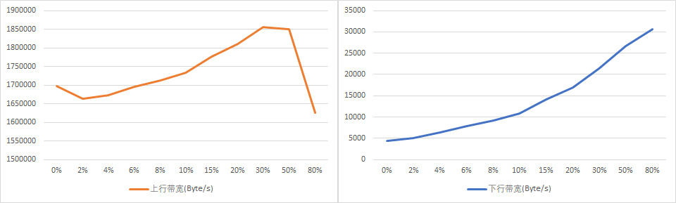
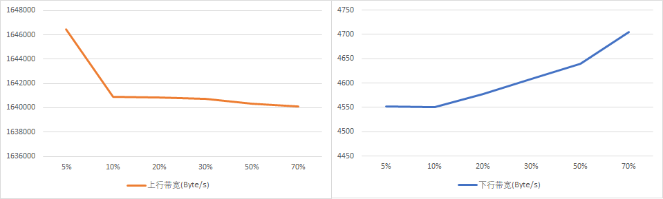
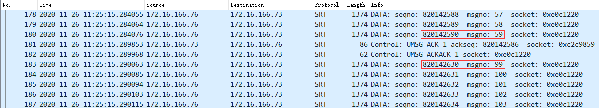
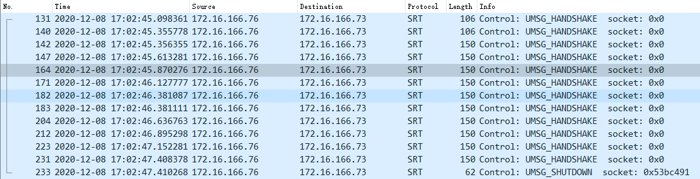
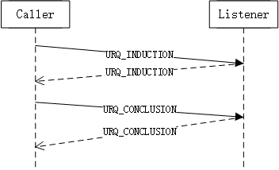
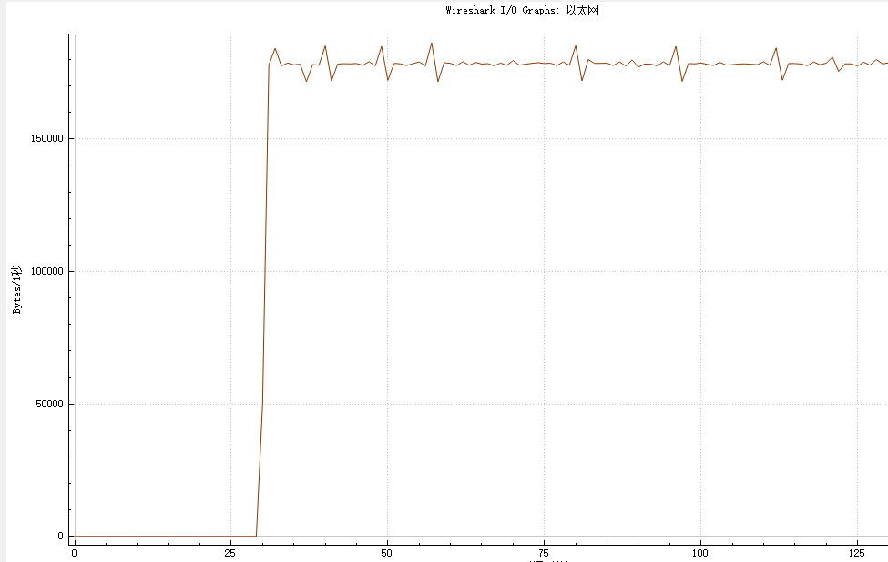
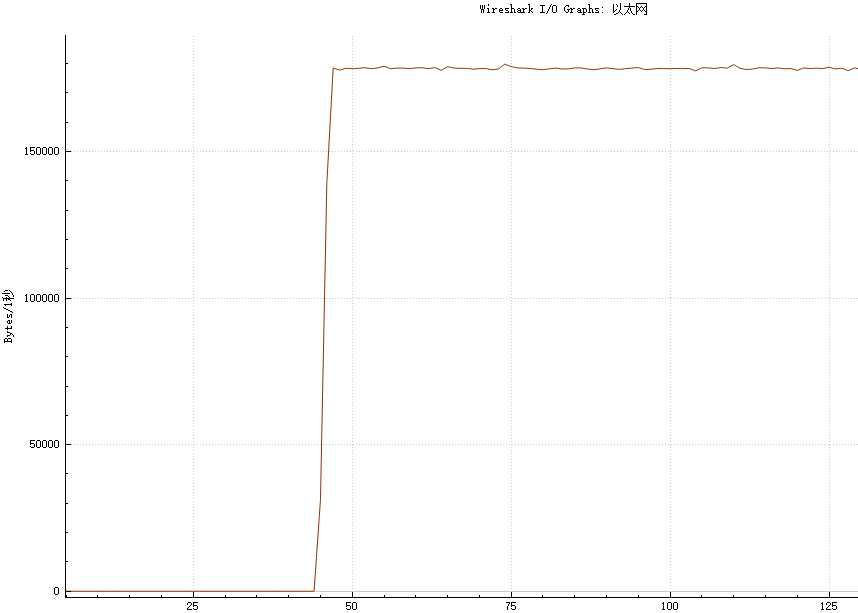

# SRT Live模式性能

## 测试

对弱网、不同延迟场景下的测试数据分析，测试数据参考[SRT推流测试](srt_publish_test.md)。

### 丢包场景

在局域网带宽充足的情况下，直播推送上行丢包和SRT比特率的关系如图：



从图中上行带宽中可以看出随着丢包率的上升，上下行的比特率也开始增加，这个主要是由于SRT为保证数据实时性，采用快速重传机制导致。接收端预测到可能出现丢包后会发送NAK包请求重传，发送端收到NAK后会在`Loss List`中找到对应的数据包重传，这样发送带宽就会随着丢包率的上升而增加。

上行比特率在30%到50%间到达顶峰，然后快速下降。

直播推送下行丢包和SRT比特率的关系如图：



从数据中可以看到下行带宽对丢包率实际上并不敏感，丢包率在70%的情况下，平均带宽只增加了253个字节，这其实相对于每秒只多了3个ACK包(一般ACK包86个字节)，这个性能表现相对TCP来说是非常优秀的，这个主要得益于SRT的按序批量确认机制能够较好的适应高丢包环境以及减少ACK数量，这样类似的机制也在很多现代的传输协议中使用例如QUIC。

上行带宽的波动也是较小的，主要的原因是网络延迟比较小和SRT的ACK机制在丢包的情况还是可以比较及时的确认数据包接收，即使出现ACK包丢失，后续的ACK包的确认数据也能覆盖已丢失的ACK。最极限的情况是ACK按周期10ms发送，在丢包环境中对于任意的一个包被确认的时间也只是有概率会延迟几十毫秒。

## 推送调优

### 高质量网络中提高数据传输稳定性

在局域网丢包环境测试中，即使丢包率和平均延迟非常小，通过抓包中的数据报序号不连续现象发现存在丢包，抓包中也存在重传现象，经过多次测试都存在同样的现象，可以排除是概率的丢包事件。



通过抓包中的`Message Number`字段可以看到第59个数据包发送后就是第99个数据包，对于SRT协议来说数据包序号是递增的，这里可以推断这个丢包行为肯定是在网络链路方面。对前59个数据包做流量统计传输速度大概在101,459,324Byte/s(96.75MiB/s)，测试环境是100Mbps局域网和1000Mbps的网卡，这个瞬时流量已经接近网卡的能力上限，远超网络带宽的上限，丢包肯定会出现了。

虽然数据传输的平均流量很低，如果应用层的音视频处理能力较强，就会出现瞬时发送多个音视频包，这样就导致了瞬间的流量非常高。往往网络I/O速度远低于主机处理速度，所以任何网络环境下一定要做流量整形。（*感觉这个也是将UDP直接用于传输实时音视频数据的一个缺点*）

SRT中默认的流量控制策略是同步输入的流量，就是依靠外部输入来控制，但是对于视频数据的传输要控制输入速率就必须要拆包，这个是相对来说是比较难控制的。优先还是要通过在SRT传输层进行流量整形控制，libSRT可以通过`SRTO_MAXBW`选项来控制发送带宽上限达到限制突发流量的效果。通过设置`SRTO_MAXBW`到10MiB/s后再进行多次测试，均未出现数据包重传情况，多次测试统计平均的带宽大约13,169kbits/s，推流数据的平均带宽12,637kbits/s，除去包头数据后基本和原始数据带宽一样。

综合上面的分析，**在任何网络环境下，要提高传输效率和稳定性必须设置最大上行带宽即`SRTO_MAXBW`选项**。这个值最好设置为网络上行速度的80%（需要考虑其它的数据流量），但是在广域互联网络的应用中，带宽值的准确测量是非常困难的，这一部分还涉及到SRT的带宽动态检测策略，在接下来的丢包等复杂的模拟测试中再进行详细分析。

>通过对libsrt的代码分析，应对本地网络I/O导致丢包的最好解决方案是将发送缓存中的`m_iInRateBps`字段的初始值设置为网卡带宽，但是libsrt目前并没有开放这个配置，它的默认值是1Gbps。

### 弱网环境中的连接稳定性

#### 握手

丢包率较高的情况下，默认的配置情况下SRT建立连接的概率会比较低，大概在80%丢包情况下基本无法建立连接。



通过抓包，发现大概2.5秒内握手失败就会出现连接建立失败，这一点是由于libsrt的`SRTO_CONNTIMEO`选项默认值就是3000ms。通过查阅libsrt连接代码，在连接超时的计时开始后会有一段的处理过程才会发送握手包，所以握手超时时间会比设置的超时时间还可能会少一些。应用层可以通过增大连接超时时间或是再重新尝试连接来应对突发性的网络丢包导致的连接失败问题。

握手包的重传时间大概是250ms，在SRT的CUDT::startConnect接口中看到写死了握手包间隔250ms。对于丢包较高的场景下，这个重传时间相对来说太长，一般在实际应用中客户端和服务的RTT基本在100ms内，握手包快速的重传能较好的减少丢包环境下的连接延迟。*握手包的重传超时时间目前只能通过修改libsrt代码进行调整，如果可以动态配置会比较好。*

srt链接建立从协议上看需要2个RTT(Caller/Listener握手)，

srt链路建立到应用数据开始收发中间需要一次初始请求报文和一次参数确认报文，所以需要2个RTT时间才真正意义上建立了连接，如果是这样的话相对TCP并没有带来更快的连接速度，但是相对于标准TLS会节约1个RTT。对握手报文中的数据进行分析，其实URQ_INDUCTON报文和URQ_CONCLUSION报文完全可以合并的，在srt1.3.0版本前(HSv4)的握手流程和UDT的握手流程一致，在1.3.0后(HSv5)将握手报文中的扩展信息和握手包合并了，合并后的报文完全可以支持1个RTT建立连接，但是目前在libsrt的[SRT Handshake](libsrt/handshake.md)文档中说明了对于`Caller`必须将握手包的版本设置为v4，这样做可以兼容旧版本的握手协议。当前并没有查到srt协议对这方面更多的讨论，通过对libsrt代码分析确认目前只有对等模式会将启用v5的握手包，其它情况都是连接方启用v4握手包。这一点对于推流来说并不会带来较大影响。

#### 链路稳定性

在丢包环境测试中，当丢包率提高到80%时，连接很快就会断开，通过对通信双方的日志分析(`11:30:57.062101/SRT:RcvQ:w1*E:SRT.qr: @501363501:SEQUENCE DISCREPANCY. BREAKING CONNECTION. seq=366721890 buffer=(366713689:366721877+366721880), 11 past max. Reception no longer possible. REQUESTING TO CLOSE.`)和抓包，都是在服务侧主动断开连接。

通过对SRT代码分析，发现断开的原因是SRT收到了一个数据包，这个数据包的超过了接受队列可以存放的上限且接受队列中当前没有被确认的数据，就会触发连接中断（详情参考[《libsrt缓冲区》](libsrt_buffer.md)）。目前根据libsrt缓冲区的处理策略，如果通过参数进行调整，只能通过减小发送缓冲区或是增大接收缓冲区来最大限度避免数据包序号溢出接收窗口的问题。如果流接收端可以配置缓冲区，可以适当的增大，但是在推流服务上一般无法进行调整，只能是发送端降低发送缓冲区大小。

较小的发送缓冲区会在出现丢包后导致应用层发送速度受限（主要是受ARQ机制ing下），通过测试将发送缓存区设置到接收缓冲区的1/4，发送帧率从25fps降低到了5.4fps（原始视频码率16Mbps），画面这时大面积马赛克，但还是在持续播放，在较长的时间内没有出现连接断开的情况。缓冲区的大小在会影响到数据传输效率，它的限制在下文中讨论。

libsrt这个断开连接的代码处理逻辑还可以优化调整，在直播模式下，在接收端接收到数据包说明相应媒体数据已经达到了播放时间，即使是这个数据溢出了缓冲区，接收端这时也应该控制缓冲区窗口快速的向后移动，而不是丢弃这个数据。

```c
//packet_time 包时间戳
//packet_play_end_time 包的最晚交付时间
//latency 包最大交付延迟
//time_now 当前时间
packet_play_end_time = packet_time + latency;
if (packet_play_end_time > time_now)
{
    //交付缓冲区中所有的数据
    all_buffer_ready();
    //包添加到缓冲区
    push(packet);
    //触发一次缓冲区校验，发送ack等
    awaken_check();
}
else
{
    //缓冲区窗口向后移动
    move_buffer(packet_seq - first_packet_seq - buffer_size);
    //触发一次缓冲区校验，发送ack等
    awaken_check();
    //包添加到缓冲区
    push(packet);
}
```

#### FEC

SRT同时支持确认重传机制(ARQ)和前向纠错(FEC)抗丢包，ARQ机制是SRT协议的核心传输控制机制，一般都是只使用ARQ，目前FEC通过Filter方式提供。根据一些其它测试资料看SRT的FEC还不稳定，而且在音视频数据层做FEC相对来说更好，这里暂不分析讨论。

### 公网传输稳定性

一般公网环境的特性是有较大的延迟（RTT可能在百毫秒级），存在随机丢包，带宽受限。

通过测试发现srt对延迟适应性较好，在600ms的rtt情况下传输速度和数据准确性基本没有受到影响，而且延迟的适配可以通过libsrt中的Latency选项调整。

对于srt的传输稳定性最大影响因素在带宽和丢包，公网链路中带宽能力随时都可能发生变化，传输过程可能会发生链路拥塞，导致数据延迟或是丢包，丢包会触发ARQ，它就可能进一步导致网络拥塞，影响到数据传输，带宽因素最终还是体现在丢包上。

最核心的因素就是丢包，它可以分为链路中随机的丢包和拥塞丢包，一个理想中的协议是遇到随机丢包直接重传数据，遇到拥塞丢包降低发送码率的同时重传，但实际上两种情况很难区分（有些路由可以回送拥塞消息）。TCP中基本都是当作拥塞丢包，但是实时数据的码率在传输过程是基本在一个范围内波动，对带宽有硬性的要求，这是保证实时数据传输正常传输的前提，所以srt没有降低发送码率。libsrt的Live模式采用的方法是全部当作随机丢包，丢包发生后立即重传，它的带宽控制也是很简单的只要发送速度不大于初始设定的最大带宽就行，这样会带来两个问题：

1. 不计链路带宽的重传会导致链路传输质量进一步下降。
2. 即使在网络带宽足够的情况下仍然会出现丢包。

这些必须通过引入BBR等拥塞控制算法再结合实时数据传输对带宽的要求特性进行改造优化。

在带宽10mbps公网中进行了推流测试，数据码率大概1200kbps，将发送带宽限制在大概16mbps:



将发送带宽限制在大概2mbps:



从统计看2mpbs的的带宽设置下流量比16mpbs的带宽设置更平滑，从抓包中的数据看，2mpbs测试10分钟出现一个丢包重传，但是16mpbs平均每分钟都有2个丢包重传。合理的带宽限制确实能带来更好的传输稳定性，这一点目前在libsrt中只能同通过限制最大发送带宽进行控制，在上面的`高质量网络中提高数据传输稳定性`章节中也有一些相关分析，目前在应用中可以将`SRTO_MAXBW`调整为码流平均码率的两倍，但最好不要超过网络链路带宽限制的90%。

>目前只是在一个相对固定的环境中进行测试，受测试条件限制未进行大面积，不同区域和不同网络运营商等环境的测试。

## 参考

### SRT应用在直播中的优缺点

优点：

1. 速度快，无论是丢包环境还是，高延迟的场景，SRT都能快速的传输码率。
2. 更高的带宽利用效率，发送数据和反向确认包的比例可以高达（64:1），是传统TCP的64倍。
3. 可靠性和实时性有非常好的平衡，而且可调。

缺点:

1. 图像和语音破碎，丢包率较高的Live场景中由于SRT的传输特性决定了它是一定会丢包的，丢包就会带来音视频数据不完整，如果是关键帧上的丢包则图像的异常会持续影响一个GOP。但是这一点可能可以通过接受端根据包时间戳和数据序号识别坏帧，对表现的现象进行一些优化。
2. Live模式下的带宽适应策略还是太简单，在公网中运行可能不稳定。

### 引用资料

1. [《SRT Socket Options：LibSRT支持的选项》](libsrt/srt_options(zh).md)

### 一些重要的BUG

1. [[BUG]Connection failure if handshake conclusion response is lost](https://github.com/Haivision/srt/issues/1648)
